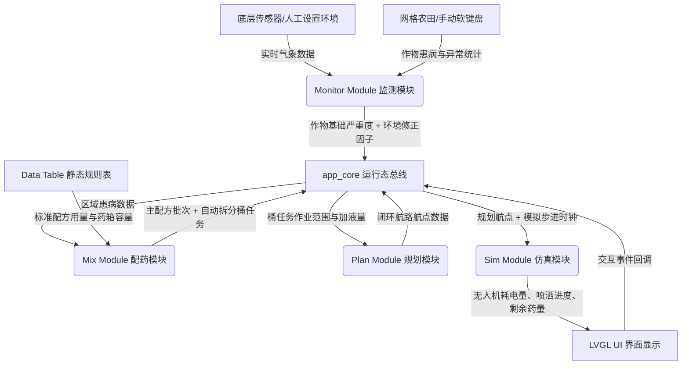
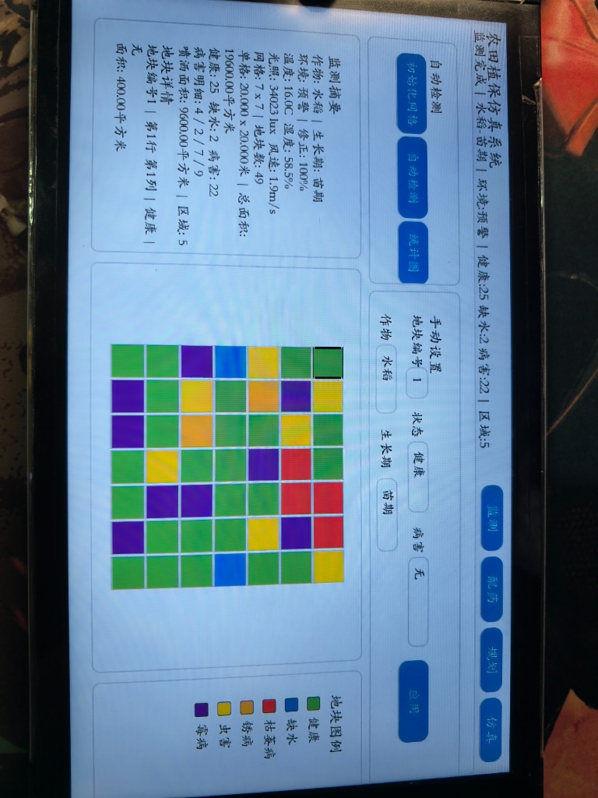
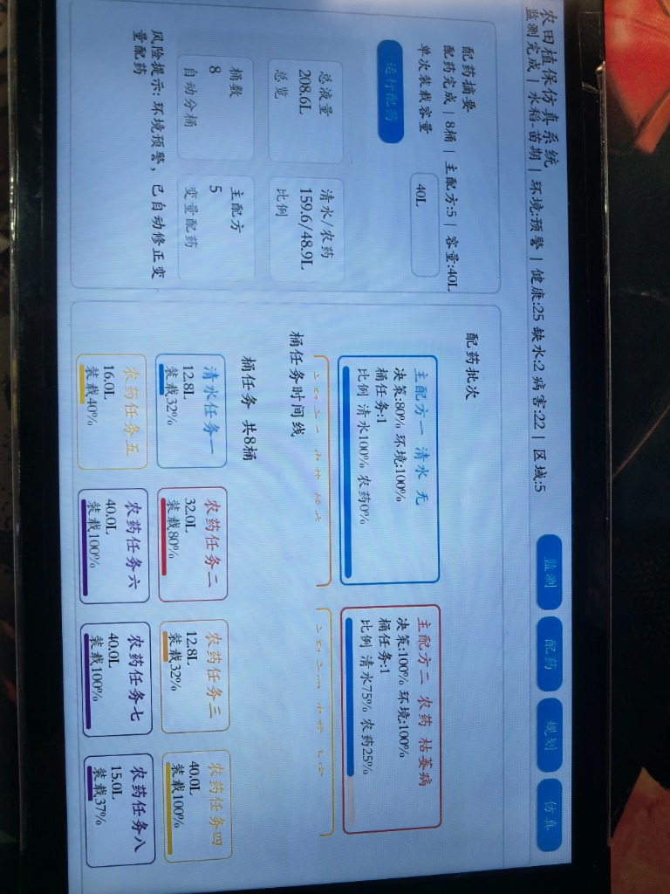
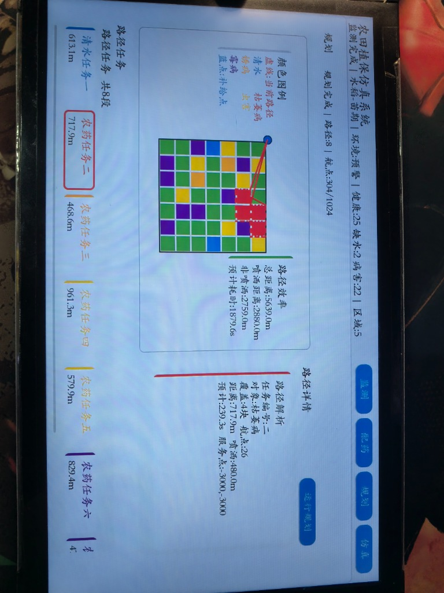
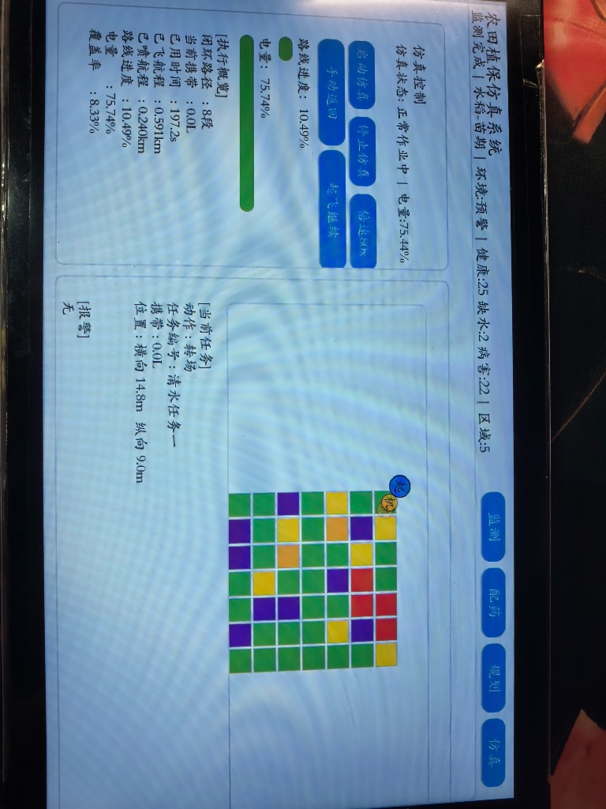
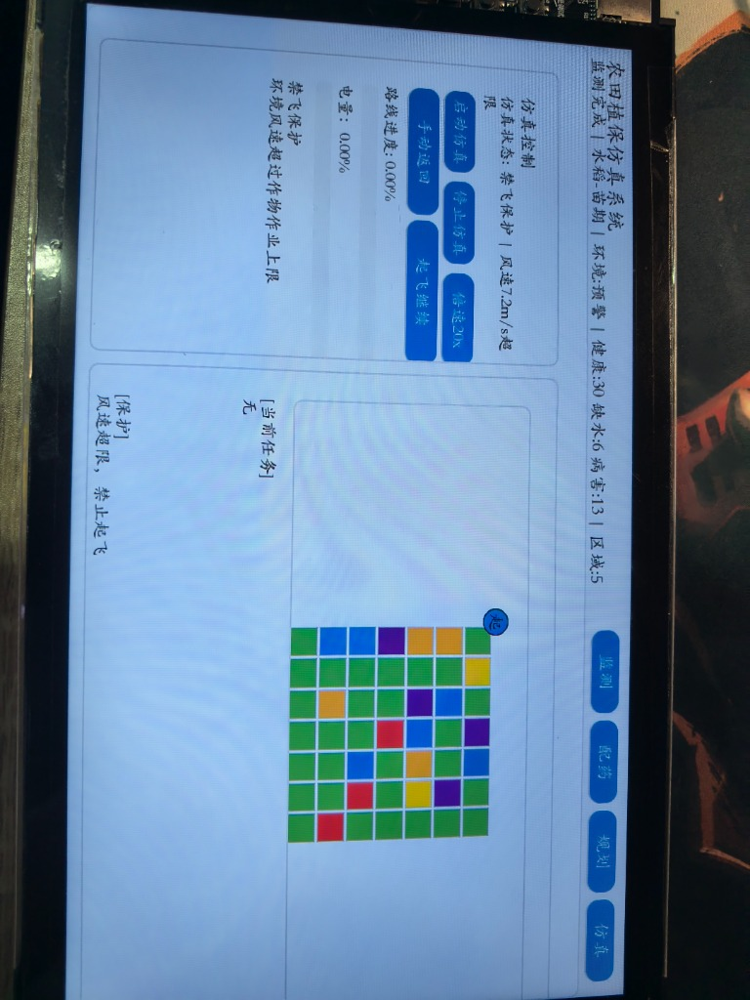

# 农田无人机喷洒农药模拟系统

本项目是一个基于 **GD32H7xx (ARM Cortex-M7)** 嵌入式微控制器平台以及 **LVGL v8** 高级图形库开发的“数字化农田无人机喷洒模拟控制系统”。系统采用模块化与高内聚设计，在物理设备上完整地仿真了从**农作物的异常监测**、**气象气温用药补偿**、**多批次智能配药与分箱拆分**、**无人机闭环航线规划**到**飞行与喷洒动态仿真**的数字化智慧农业全生命周期流程。

---

## 目录
- [📐 1. 系统总体架构与数据流向](#1-系统总体架构与数据流向)
- [🖥️ 2. 四大核心交互视窗功能详解](#2-四大核心交互视窗功能详解)
- [🧠 3. 核心数学模型与算法推演](#3-核心数学模型与算法推演)
- [✨ 4. 工业级嵌入式代码亮点解析](#4-工业级嵌入式代码亮点解析)
- [📁 5. 项目源码目录与跳转地图](#5-项目源码目录与跳转地图)
- [🛠️ 6. 工程编译与烧录运行指南](#6-工程编译与烧录运行指南)
- [📝 7. 开发与提交备案信息](#7-开发与提交备案信息)

---

## 📐 1. 系统总体架构与数据流向

系统依托底层的物理硬件定时器以及主程序主循环（[main.c](./main.c)）驱动，利用 `app_core` 作为全局的数据总线与接口调度层，实现核心业务算法与 LVGL UI 的彻底解耦。

### 🔄 系统模块交互与数据流向图



---

## 🖥️ 2. 四大核心交互视窗功能详解

系统界面适配主流嵌入式液晶屏（如 $1024 \times 600$ 或 $800 \times 480$ 物理分辨率），通过动态计算显示区域进行居中排布。

### 1. 顶部全局状态栏 (Header Panel)
* **动态页面切换**：提供“监测”、“配药”、“规划”、“仿真” 4 个导航卡片。按钮的切换自带微动画，并由当前全局状态机控制使能（例如：在仿真运行时，其他设置页面将置灰禁止跳转，确保操作安全）。
* **全局信息通报**：在状态栏中央，系统实时上报当前的操作状态与后台运行代码（如 `ERROR CODE`、`STATE: IDLE` 等）。

### 2. 农田状态监测模块 (Monitor Page)
* **$12 \times 12$ 模拟农田网格**：
  * 地块以独立的按钮形式展现，使用 LVGL 背景样式来表现不同的状态。
  * **绿色**代表健康，**黄色**代表缺水，**红色**代表枯萎病，**橙色**代表锈病，**紫色**代表虫害，**蓝色**代表霉病。
  * 点击任意网格，右下角的“地块详情面板”会瞬间显示该地块的绝对物理坐标、行/列位置、真实物理面积，以及根据统计自动关联的受灾严重度。
* **数据输入双工作模式**：
  * **自动检测**：通过随机种子快速模拟全场的大范围异常分布。
  * **手动微调（软键盘输入）**：点击地块编号框后激活屏显数字键盘（`manual_keyboard`），允许输入指定地块，并结合“状态”与“病害”下拉菜单，点击“应用”按钮修改地块属性，系统会自动触发局部重绘并实时重算统计值。
* **气象环境面板**：实时解析并显示由底层模拟传感器上报或人工修改的温湿度、光照及风速数据，并在下方直接通报该环境是否符合飞行喷洒规范。



### 3. 智能配药配方模块 (Mix Page)
* **主配药批次卡片（Main Batch Cards）**：
  * 针对场上存在的病害类型（最多 5 种），生成独立的作业卡片。
  * 包含当前药品的化学稀释比，清水与浓缩农药的调配比例，以及基于严重度计算的总药液需求量（升）。
* **药箱规格选择（Tank Selection）**：
  * 提供 `5L`、`10L`、`15L`、`20L`、`25L`、`30L`、`40L`、`50L`、`60L` 药箱选项。
  * 当药箱容量改变时，系统自动对全局药量进行重新分拆，实时改变预计作业架次。
* **加药作业分拆看板**：
  * 以列表形式展示每一架次（一桶水作业）的加水量和加药量（毫升），用于加药员现场称重参考。



### 4. 路径规划算法模块 (Plan Page)
* **多桶路径图层叠加**：在生成的航线图层上，蓝色圆点标记服务点（基站），不同药剂的作业路线使用不同的色线进行渲染。
* **路径时间轴控制卡片**：
  * 下方提供水平滑动的桶任务卡片。点击某桶任务时，地图上该段折线航路会加粗显示为虚线（表示当前关注的飞行段）。
  * 右侧“路径详情”面板展示其关联的覆盖地块块数、总航点、预估总距离、有效喷洒距离、空载转移距离及电池飞行耗时。
* **全场总效率计算看板**：汇总列出完成全部农田喷洒无人机需要飞行的总里程、非喷洒的折返耗损里程、以及全部周期的总耗时。



### 5. 飞行与喷洒仿真模块 (Simulation Page)
* **机载状态显示器**：实时刷新飞机的剩余药量（升）、电池电量（%）、总工作时间及累计覆盖率（%）。
* **仿真状态机跟踪**：通过文本形式报告无人机当前正在执行的飞控动作：包括“起飞中”、“正在喷洒”、“空载转移”、“电量不足自动返航”、“药尽返航”、“充电/补液中”、“仿真圆满完成”。
* **结案作业报告**：仿真结束后，弹窗并常驻作业总结。显示清水/农药消耗总量（升）、总充电和加药架次，以及全场最终覆盖率评估，作为农作物的作业质量凭证。




---

## 🧠 3. 核心数学模型与算法推演

系统在嵌入式平台上运行了一套高度自动化的“药量补偿”与“自适应避障/回航规划”算法。

### 1. 药量补偿决策模型
为了在环境恶劣（如高温、极度干燥）时确保药效，系统设计了双因子动态用量修正模型。

1. **基础决策系数 ($D_{\text{base}}$)**：
   统计单类异常地块的占比：
   $$\text{受灾占比} = \frac{\text{该异常类型地块数}}{\text{总地块数}}$$
   * 若受灾占比 $< 8\%$：决策系数为 **轻度 ($80\%$)**
   * 若受灾占比 $8\% \sim 16\%$：决策系数为 **中度 ($100\%$)**
   * 若受灾占比 $> 16\%$：决策系数为 **重度 ($120\%$)**
2. **环境修正因子 ($F_{\text{env}}$)**：
   外界环境压力每增加一项（超过适宜作物生长的上限/下限），修正因子增加 $10\%$ 药量补偿（上限 $120\%$）：
   $$F_{\text{env}} = 100\% + 10\% \times [T_{\text{temp\_high}} > T_{\text{limit}}] + 10\% \times [H_{\text{hum\_low}} < H_{\text{limit}}] + 10\% \times [L_{\text{light\_high}} > L_{\text{limit}}]$$
3. **单地块总药液需求量 ($V_{\text{total}}$)**：
   结合基础配方用水量（$V_{\text{water}}$）与农药基准量（$V_{\text{pest}}$），最终用液量公式为：
   $$V_{\text{total}} = (V_{\text{water}} + V_{\text{pest}}) \times \text{地块面积} \times \frac{D_{\text{base}} \times F_{\text{env}}}{10000}$$

### 2. 无人机自适应续航规划
在航线仿真阶段，无人机受到电量和药量的双重约束，其状态迁移逻辑如下：

```text
[SIM_STATE_TAKEOFF] (起飞)
         │
         ▼
[SIM_STATE_FLYING] (向目标点转移)
         │
         ├──► [到达起点] ──► [SIM_STATE_SPRAYING] (喷洒作业) ──► 消耗电量/药量
         │
         └──► [检测到电量或药量不足] 
                     │
                     ▼
             [SIM_STATE_RECALLING] (强制中止作业，沿捷径飞回服务点)
                     │
                     ▼
             [SIM_STATE_REFILLING] (在基站进行快速充电和药液重装)
                     │
                     ▼
             [SIM_STATE_FLYING] (重返断点，继续作业)
```

* **安全电量返回阈值算子**：
  在仿真飞行的每一步，飞控会实时计算：
  $$\text{安全返回电量} = \frac{\text{当前位置到服务点的距离} \times \text{单位距离耗电系数}}{\text{电池总容量}} + 15\%\text{（安全冗余）}$$
  一旦当前电量百分比降至该临界阈值，飞控立即中止当前航线，执行返航保护。

---

## ✨ 4. 工业级嵌入式代码亮点解析

### 亮点一：纯整型的高精度定点数算法 (Fixed-Point Library)
* **设计意图**：避免在 Cortex-M 微控制器上调用昂贵的浮点库指令，排除多平台编译带来的浮点累加误差。
* **实现方案**：系统在 `app_math.h` 中规定了统一的物理单位整型放大机制。
  * **坐标与距离**：以毫米（`mm`）存储（如 $5\text{m}$ 保存为 $5000\text{mm}$）。
  * **面积**：以 `m2_x100`（即 $\text{m}^2 \times 100$）保存。
  * **体积**：以 `ml_x10`（即 $\text{ml} \times 10$）保存。
  * **比率/系数**：以 `x100`（即百分比）保存。
* **效果验证**：在配药模块中，数千平方米农田的总药液计算仅需微秒级即可在物理 CPU 上计算完毕，且计算结果与浮点数相比无任何累积误差。

### 亮点二：大尺寸地块物理“切片/切分”算法 (Slicing)
* **设计意图**：当单个地块的药量需求远超一整桶药箱容量时，防止发生一桶药只喷洒了半块地就返回，导致农药分布不均。
* **实现方案**：系统在 [mix_module.c](./Modules/mix_module.c) 实现了空间坐标切分算法。如果 `单块地总需药量 > 药箱容量`，系统会根据该地块的几何边界及喷幅进行空间分片：
  1. 计算当前桶能够覆盖该地块的比例；
  2. 生成当前桶任务在该地块上的前半段边界坐标（`max_x_mm`），将其分配给当前桶；
  3. 将剩余的干涸部分作为一个独立的新 Chunks 元素加入队列，分配给下一桶，并更新其左边界起点为上一段的右边界。
  4. 这种算法让物理层面的加水、换药与飞行轨迹完美无缝衔接。

### 亮点三：LVGL 极限制约下的“零堆碎片化”内存控制
* **设计意图**：嵌入式微控制器的堆内存（Heap）非常宝贵，频繁调用 `lv_obj_create` 与 `lv_obj_del` 会导致严重内存碎片，引发系统随机挂机。
* **实现方案**：
  * **静态容器常驻**：每个页面的基座容器（如 `plan_page`、`sim_page`）在初始化时一次性创建好。
  * **高开销控件回收函数**：对于频繁变化的航线画线（Line）、折线点阵以及统计卡片，在切换页面时调用特定的释放函数：
    * [ui_mix_release_visual_content](./Modules/ui_module.c) 清理配方卡片。
    * [ui_plan_release_heavy_text](./Modules/ui_module.c) 回收路径折线资源。
  * 这种生命周期设计保证了在持续运行数十小时后，系统堆栈水位线依然保持在安全线以下，没有一字节的内存泄露。

### 亮点四：图形底图自适应缩放映射 (Auto-Scale Canvas)
* **设计意图**：由于实际的农田面积和无人机飞行航程是以几百米计，而在屏幕上只有几百像素，必须在微控制器上实现快速的缩放映射。
* **实现方案**：在 [ui_module.c](./Modules/ui_module.c#L2675-L2697) 中实现了 `ui_plan_calc_map_layout`。每次启动规划时，系统会扫描所有地块的最小/最大 $X$、$Y$ 坐标边界，并根据液晶屏当前的画布大小，自动计算横向和纵向的缩放比率 `scale_px` 以及居中偏移原点 `origin_x`/`origin_y`，使得无论什么形状的农田边界都能完美撑满屏幕且不失真。

---

## 📁 5. 项目源码目录与跳转地图

本工程的物理源码结构以及可直接点击跳转的相对路径链接如下：

### 📁 应用核心框架 ([App/](./App))
* ⚙️ **系统配置**：[app_config.h](./App/app_config.h) （配置农田网格上限、液量限制等静态参数）
* 🧠 **核心调度**：[app_core.c](./App/app_core.c) / [app_core.h](./App/app_core.h) （负责整体状态机转换及运行时的数据存取 API）
* 🧮 **定点化数学库**：[app_math.c](./App/app_math.c) / [app_math.h](./App/app_math.h) （避免硬件浮点误差的整型数学计算库）
* 🧬 **公共类型定义**：[app_types.h](./App/app_types.h) （定义地块状态、监测统计、配药分桶、规划航点及仿真指标的数据结构）

### 📁 业务逻辑与 UI 界面 ([Modules/](./Modules))
* 🔍 **健康监测逻辑**：[monitor_module.c](./Modules/monitor_module.c) / [monitor_module.h](./Modules/monitor_module.h) （处理作物状态统计、环境风险判定及严重度计算）
* 🧪 **自动配药算法**：[mix_module.c](./Modules/mix_module.c) / [mix_module.h](./Modules/mix_module.h) （检索配方表计算药量需求，执行自动拆解桶任务算法）
* 🗺️ **路径规划算法**：[plan_module.c](./Modules/plan_module.c) / [plan_module.h](./Modules/plan_module.h) （实现连续多架次喷洒及返航充能补给的规划算法）
* 🛸 **飞控仿真状态**：[sim_module.c](./Modules/sim_module.c) / [sim_module.h](./Modules/sim_module.h) （递推仿真步进，追踪无人机药量、电量及覆盖率变化）
* 🎨 **GUI 页面设计**：[ui_module.c](./Modules/ui_module.c) / [ui_module.h](./Modules/ui_module.h) / [ui_module_internal.h](./Modules/ui_module_internal.h) （基于 LVGL 8 开发的 4 个完整功能视窗交互界面及画布渲染）

### 📁 静态属性表配置 ([Data/](./Data))
* 📊 **属性数据表**：[data_table.c](./Data/data_table.c) / [data_table.h](./Data/data_table.h) （预设不同病害的标准配方比例、适宜环境条件限制及无人机基准参数）

### 📁 顶层入口与驱动
* 🚀 **系统主入口**：[main.c](./main.c) （外设时钟初始化、启动 LVGL 并挂载主执行周期）
* 🛠️ **中断服务**：[gd32h7xx_it.c](./gd32h7xx_it.c) / [gd32h7xx_it.h](./gd32h7xx_it.h) （底层定时器与硬件中断回调）
* 📌 **外设编译选项**：[gd32h7xx_libopt.h](./gd32h7xx_libopt.h) （固件库裁剪与编译裁剪定义）

### 📁 编译工程配置文件
* 🛠️ **MDK Project 文件**：[TemplateProject.uvprojx](./TemplateProject.uvprojx) / [TemplateProject.uvoptx](./TemplateProject.uvoptx) （Keil 5 的工程主配置文件，双击可直接拉起整个编译项目）

---

## 🛠️ 6. 工程编译与烧录运行指南

### 开发环境准备
1. 安装 **Keil MDK-ARM v5** 编译器（推荐 v5.30 及以上版本）。
2. 安装 **GD32H7xx 设备支持包 (DFP)**。

### 编译步骤
1. 双击打开 [TemplateProject.uvprojx](./TemplateProject.uvprojx)。
2. 在 Keil 菜单栏中选择 `Project -> Rebuild all target files` 进行全编译。
3. 编译完成后，编译目标会输出至 `Objects/` 目录中，生成 `TemplateProject.axf`（包含烧录调试信息）或十六进制镜像文件。

---

## 📝 7. 开发与提交备案信息
* **项目名称**：农田无人机喷洒农药模拟系统
* **开发成员**：郑雨鑫、邓子涵
* **提交内容**：包含完整的软件工程、外设驱动及仿真算法代码。
